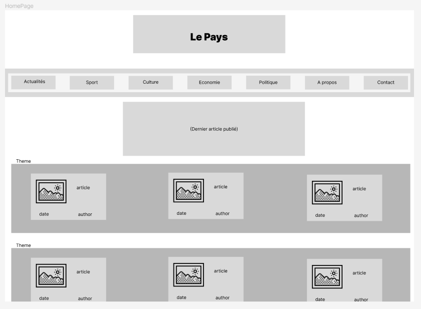
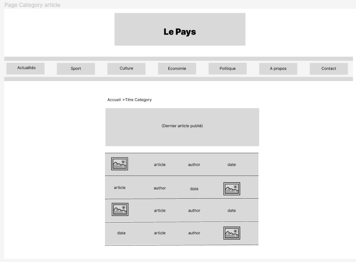
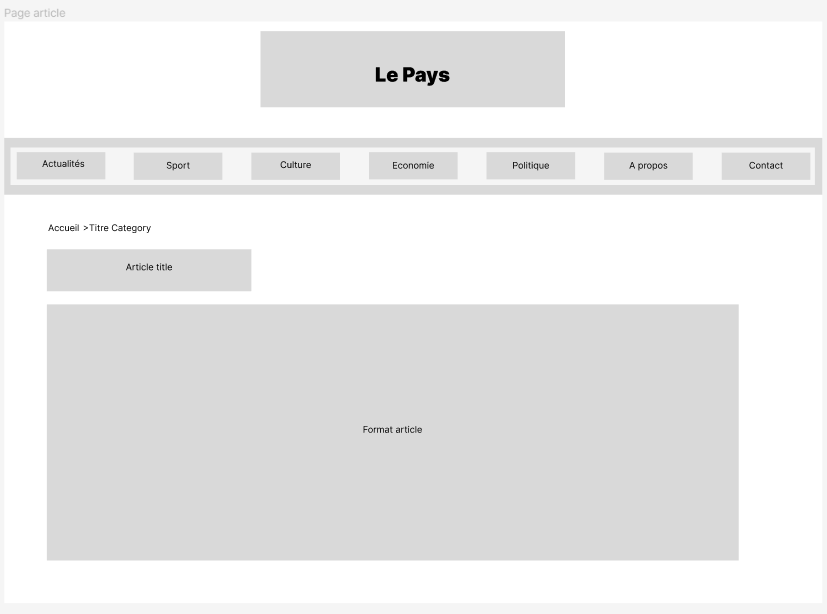
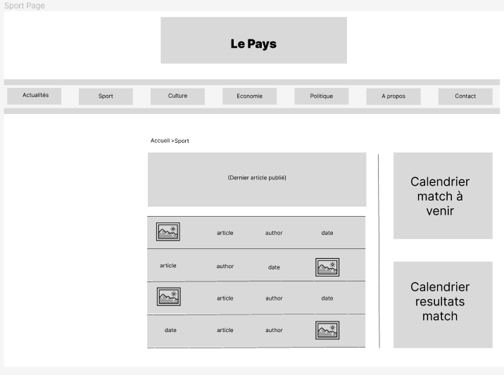

# Cahier des charges pour la création du site internet du journal local "Le Pays"

## Le journal "Le Pays"
"Le Pays" est un journal papier qui souhaite se moderniser en créant un site internet pour relayer ses informations. Le directeur souhaite que le site soit simple d'utilisation et agréable à lire, tout en conservant la qualité de confort de lecture du papier. Le journal est connu pour couvrir les événements sportifs et culturels du pays, et le site internet devra proposer un accès rapide à ces informations. Enfin, le site sera accessible sur mobile pour atteindre un public plus jeune.

## Objectif

Le journal local "Le Pays" souhaite créer un site internet pour relayer les informations de sa version papier. L'objectif est de proposer un site simple d'utilisation, agréable à la lecture et accessible sur mobile, tout en conservant le rôle premier du site qui est d'informer et de présenter les informations de manière chronologique.

## Public cible

Le site internet vise à toucher un public large, notamment des lecteurs de la version papier qui souhaitent accéder aux informations en ligne, mais également des lecteurs plus jeunes et familiers avec la technologie. Le journal a pour réputation de relayer les activités sportives et culturelles du pays, il est donc important de proposer un accès rapide aux différents évènements à venir sur les pages du site.

## Caractéristiques du site

### Design

Le site doit être agréable à la lecture et facile d'utilisation, tout en conservant le confort de lecture que peut fournir la version papier. Le design doit être sobre et épuré, avec une police de caractères facile à lire. Le choix des couleurs doit être en harmonie avec la charte graphique du journal.

### Navigation

Les articles de presse doivent être faciles à consulter ou à trouver. La taxonomie du site devra permettre de naviguer dans les contenus de manière intuitive par catégories ou à l’aide de tags. La page d'accueil devra présenter les dernières informations en priorité, avec un accès facile aux articles les plus lus ou les plus commentés.

### Accessibilité

Le site internet doit être accessible sur mobile, afin de toucher un public plus jeune et familier avec la technologie. Le site doit être responsive et s'adapter à tous les types d'écrans.

## Fonctionnalités

### Affichage des articles

Les articles doivent être présentés de manière claire et lisible, avec une mise en page adaptée pour une lecture en ligne. Les images doivent être de bonne qualité et permettre d'illustrer l'article.

### Recherche

Un moteur de recherche doit être intégré au site, permettant aux utilisateurs de trouver rapidement les articles ou les évènements qu'ils cherchent.

### Commentaires

Les lecteurs doivent pouvoir laisser des commentaires sur les articles, afin de favoriser les échanges et les débats autour des sujets abordés.

### Newsletter

Les lecteurs doivent pouvoir s'abonner à une newsletter, afin de recevoir les dernières informations du journal par email.

## Contraintes techniques

Le site doit être développé en utilisant les technologies les plus récentes et être compatible avec les navigateurs les plus utilisés. Il doit être hébergé sur un serveur fiable et sécurisé.

## Personna

    

        <h3>Isaac Netero</h3>
        
Âgé de 62 ans, Isaac est un lecteur assidu de la version papier du journal "Le Pays". Il est peu familier avec les nouvelles technologies, mais souhaite tout de même accéder aux informations du journal en ligne.

        
Isaac est à la recherche d'un site simple d'utilisation, où il pourra trouver rapidement les articles qu'il recherche et suivre les événements sportifs et culturels de la région.

    

    

        <h3>Emilie Martin</h3>
        
Âgée de 27 ans, Emilie est une lectrice régulière de la version papier du journal "Le Pays". Elle est très à l'aise avec les nouvelles technologies et souhaite pouvoir accéder aux informations du journal depuis son téléphone portable.

        
Emilie est à la recherche d'un site responsive, moderne et facile d'utilisation, qui lui permettra de consulter les dernières informations du journal où qu'elle soit.

    

    

        <h3>Takumi Fujiwara</h3>
        
Takumi est un lycéen de 18 ans passionné de voitures de sport. Il lit régulièrement des magazines spécialisés et suit les courses automobiles. Il recherche un site qui lui permettra de suivre l'actualité automobile, de voir des vidéos de courses et de discuter avec d'autres passionnés.

        
Takumi préfère les sites au design épuré et intuitif, qui mettent en avant les images et les vidéos.

    

    

        <h3>Takeshi Yamamoto</h3>
        
Takeshi est un adolescent de 15 ans passionné de baseball et de manga. Il souhaite se tenir informé des résultats des matches de baseball ainsi que des dernières sorties de manga.

        
Il recherche un site où il pourra trouver rapidement les scores des matches de baseball, les classements des équipes, ainsi que les derniers chapitres sortis de ses mangas préférés.

    

## Maquette
### Page d'accueil

### Page d'affichage categorie

### Page de lecture d'un d'article

### Page pour la categorie sport

### Page d'accueil sur mobile

### Page d'affichage categorie sur mobile

### Page de lecture d'un d'article sur mobile

### Page pour la categorie sport sur mobile

## Conclusion

Le site internet du journal local "Le Pays" doit être un outil efficace pour relayer les informations de la version papier, tout en proposant une expérience de lecture agréable et intuitive en ligne. Il doit être accessible sur mobile et offrir des fonctionnalités telles que la recherche, les commentaires et la newsletter. Le site doit être développé en utilisant les dernières technologies et être hébergé sur un serveur fiable et sécurisé.
